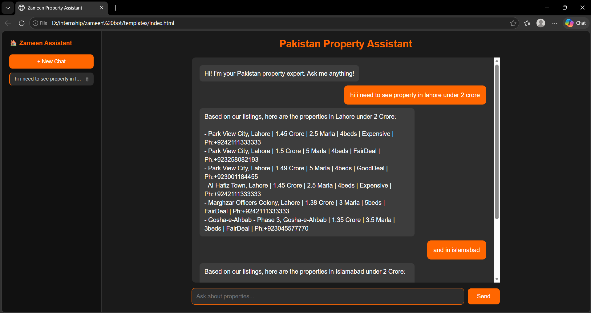
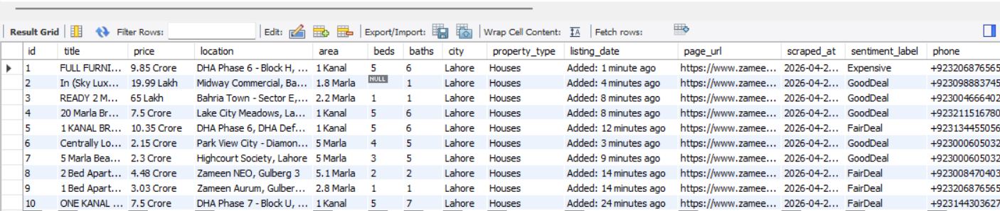
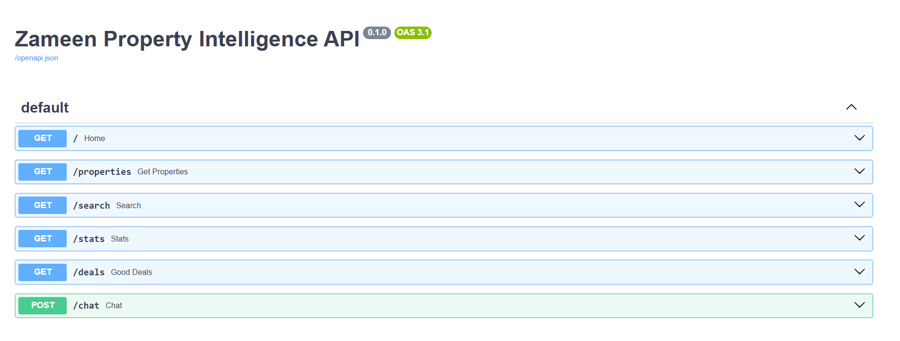

# 🏠 Zameen Property Intelligence System

An AI-powered real estate intelligence platform that scrapes live property listings from Zameen.com, analyzes deal quality using LLM, and provides an intelligent chatbot interface for property search across Pakistani cities.

> Built as part of my AI Engineering internship to learn web scraping, NLP, LLM APIs, FastAPI, and full-stack development.

---

## 🚀 What It Does

- Scrapes live property listings from Zameen.com across Lahore, Karachi and Islamabad
- Extracts phone numbers directly from page source using regex
- Stores complete property data in MySQL database
- Analyzes each listing as GoodDeal, FairDeal or Expensive using Groq LLM
- Exposes data via a REST API built with FastAPI
- Provides an AI-powered chat interface with conversation memory and chat history

---

## 💬 Chat Interface



The chat interface allows users to:
- Search properties by city, price range, size and type
- Get AI-powered recommendations with phone numbers included
- Continue previous conversations from sidebar history
- Start new chats and delete old ones

---

## 🗄️ Database



Each property record contains:
- Title, Price, Location, Area
- Beds, Baths, City, Property Type
- Phone Number, Listing URL
- Sentiment Label (GoodDeal/FairDeal/Expensive)

---

## 🌐 API Endpoints



| Method | Endpoint | Description |
|---|---|---|
| GET | / | API status |
| GET | /properties | All listings |
| GET | /search?city=Lahore | Filter by city/type/beds |
| GET | /stats | Market overview |
| GET | /deals?city=Lahore | AI-identified good deals |
| POST | /chat | AI property chatbot |

---

## 🛠️ Tech Stack

| Technology | Purpose |
|---|---|
| Python 3.10 | Core language |
| BeautifulSoup4 | Web scraping |
| Regex | Phone number extraction |
| MySQL | Data storage |
| Groq API (llama-3.1) | LLM responses + sentiment |
| FastAPI | REST API framework |
| Pydantic | Request validation |
| HTML/CSS/JavaScript | Chat UI frontend |
| localStorage | Browser-side chat history |

---

## 📁 Project Structure

```
zameen-property-intelligence/
│
├── database.py          # Database connection and setup
├── scraper.py           # Scrapes listings + phone numbers
├── sentiment.py         # LLM-based deal analysis
├── api.py               # FastAPI REST API + chat endpoint
├── pipeline.py          # Runs full pipeline automatically
├── index.html           # Chat UI frontend
└── README.md
```

---

## ⚙️ Setup & Run

**1. Clone the repo**
```bash
git clone https://github.com/Maliktalha235/zameen-com-property-intelligence
cd zameen-com-property-intelligence
```

**2. Install dependencies**
```bash
pip install requests beautifulsoup4 mysql-connector-python groq fastapi uvicorn pydantic
```

**3. Setup MySQL**
```sql
CREATE DATABASE zameen_db;
ALTER USER 'root'@'localhost' IDENTIFIED WITH mysql_native_password BY 'yourpassword';
FLUSH PRIVILEGES;
```

**4. Add your Groq API key**

Get a free key at: https://console.groq.com

Replace in `sentiment.py` and `api.py`:
```python
api_key="your_groq_key_here"
```

**5. Run the full pipeline**
```bash
python pipeline.py
```

**6. Start the API**
```bash
uvicorn api:app --reload
```

**7. Open the chat UI**

Open `index.html` in your browser.

---

## 🔍 How It Works

### Data Collection
```
Zameen.com search pages
        ↓
BeautifulSoup extracts: title, price, location, area, beds, baths
        ↓
Regex extracts phone numbers from embedded JSON in page source
        ↓
Duplicate check → save to MySQL
```

### AI Analysis (RAG Pipeline)
```
Property data from MySQL
        ↓
Sent as context to Groq LLM
        ↓
LLM labels each as: GoodDeal / FairDeal / Expensive
        ↓
Labels saved back to database
```

### Chat Interface
```
User types question
        ↓
JavaScript detects city → fetches relevant properties from API
        ↓
Properties + conversation history sent to LLM
        ↓
LLM answers with real data, phone numbers, prices
        ↓
Response displayed in chat UI
        ↓
Chat saved to browser localStorage
```

---

## 💡 Key Technical Highlights

- **RAG Pipeline** — LLM answers based on real scraped data, not general knowledge
- **Smart filtering** — API detects city from question and fetches relevant properties only
- **Phone extraction** — regex parses phone numbers from embedded JSON without extra requests
- **Conversation memory** — full chat history sent with every request so LLM remembers context
- **Browser storage** — chat history persists across sessions using localStorage

---

## 📊 Sample API Responses

**GET /stats**
```json
{
  "total_properties": 349,
  "by_city": {"Lahore": 150, "Karachi": 75, "Islamabad": 124},
  "by_type": {"Houses": 200, "Flats": 149},
  "deal_analysis": {"GoodDeal": 87, "FairDeal": 198, "Expensive": 64}
}
```

**POST /chat**
```json
{
  "question": "Good deals in DHA Lahore under 3 crore",
  "history": []
}
```

---

## 📚 What I Learned

- Web scraping with BeautifulSoup and handling real-world sites
- Regex for extracting structured data from unstructured HTML
- MySQL database design with duplicate prevention
- RAG pipelines — giving LLMs domain-specific data as context
- REST API development with FastAPI and Pydantic validation
- Conversation memory in LLM applications
- Frontend development with HTML, CSS and JavaScript
- Browser localStorage for client-side data persistence

---

## 👤 Author

**Talha Malik** — AI Engineer Intern
GitHub: [@Maliktalha235](https://github.com/Maliktalha235)
LinkedIn: [Talha Malik](https://www.linkedin.com/in/talha-malik-664189310/)
